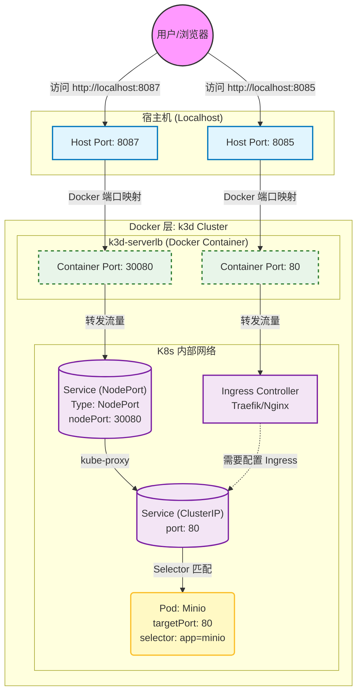

这是一个非常清晰的 k3d 到 Kubernetes 内部 Service 的端口映射案例。

在这个配置中，你主要有两条路径进入集群：

1. **直接 NodePort 路径 (Port 8087)**：这是你提供的 Service 配置直接生效的路径。
2. **Ingress/LoadBalancer 路径 (Port 8085/8443)**：这是 k3d 默认暴露给 Ingress Controller（通常是 Traefik）的路径。

以下是基于你提供的配置绘制的 Mermaid 拓扑图：

### 端口映射拓扑图

---

### 详细解析

根据你的配置文件，流量流向分为两种情况：

#### 1. 成功连通路径 (对应端口 8087)

这是目前配置最直接的访问方式。

* **宿主机 (8087):** 用户访问 `localhost:8087`。
* **k3d 映射 (30080):** k3d 的配置文件显式声明了 `port: 8087:30080`。这意味着宿主机的 8087 流量被送到了 k3d 负载均衡容器的 30080 端口。
* **Service (30080):** 你的 Service 定义了 `nodePort: 30080`。因为 k3d 的负载均衡器会自动把流量转发到节点的 NodePort 上，所以流量成功进入 Kubernetes Service。
* **Pod (80):** Service 将流量从 `port: 80` 转发到 Minio Pod 的 `targetPort: 80`。

#### 2. Ingress 路径 (对应端口 8085)

* **宿主机 (8085):** k3d 默认或配置中将 8085 映射到了容器的 80 端口。
* **Ingress Controller:** 在 k3d/k3s 中，容器的 80 端口通常监听的是 **Traefik** (Ingress Controller)。
* **断点:** 除非你另外编写了一个 `Kind: Ingress` 的 yaml 文件，明确告诉 Traefik "将 host 为 xxx 的流量转发给 minio service"，否则通过 8085 访问只会看到 Traefik 的默认页或者 404。

### 接下来你可以做什么？

如果你希望通过 `8085` (标准的 HTTP 入口) 访问 Minio，而不是使用 `8087`，你需要应用一个 Ingress 资源。

**你需要我为你生成这个 Ingress 的 YAML 文件吗？**